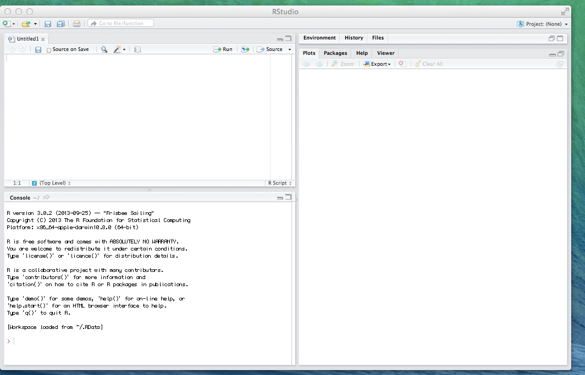
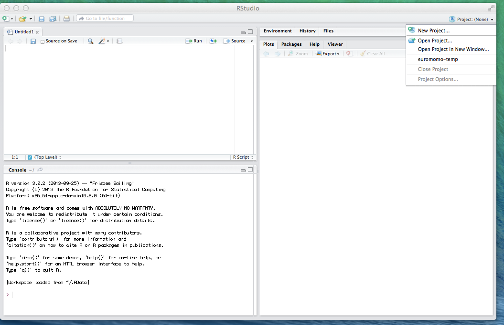
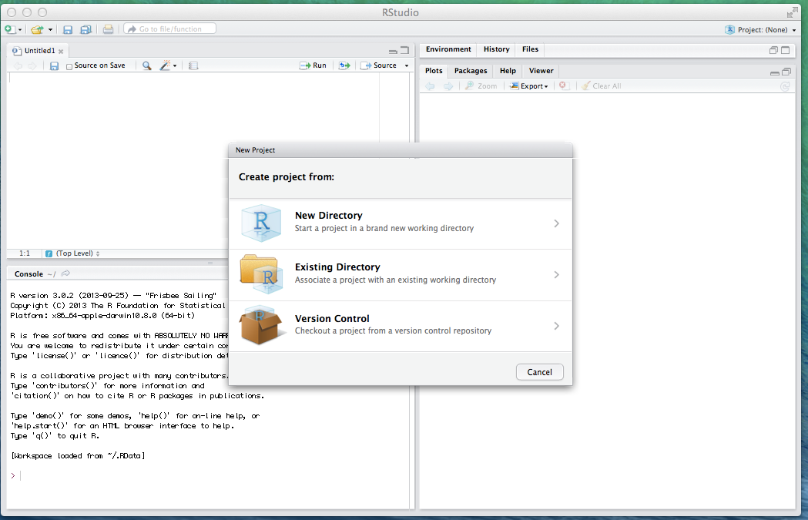
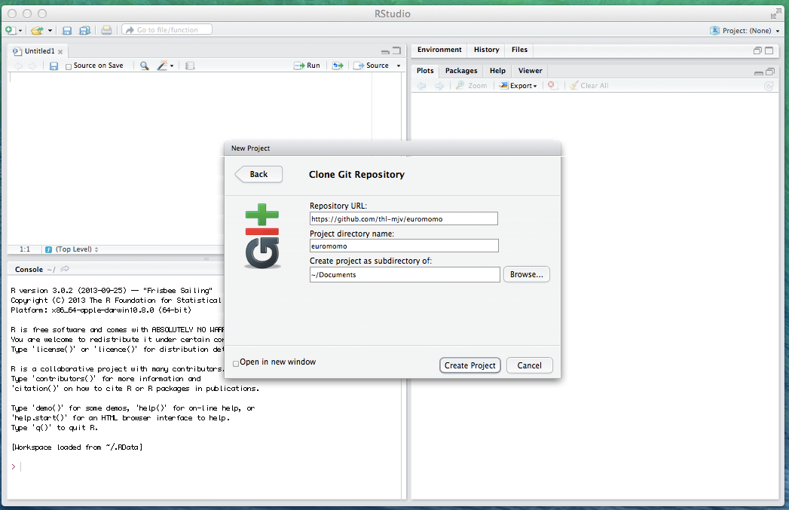

Developing euromomo package
===========================

Install required tools
----------------------

1. Rstudio
2. Github

Download project files
----------------------

1. From top right corner select _Project_

2. From the dropdown, select _New Project_

3. Select _Version Control_

4. Select _GIT_ . If this is not available, recheck the installation of git

5. Fill in as below (Fill the last as you wish)

Develop
-------

Subdirectory __dev__ has a sample momomaster.R that can be used for testing during development. Copy the source data (deaths and bank holidays) here. Also, copy the defaults-example.txt from the project root here as defaults.txt and modify. Test run.

The actual code is in R/ . The code uses Roxygen2 to produce documentation. Install the package using "Build and reload" from Build -menu. 

Commiting changes
-----------------

Always build before commit

