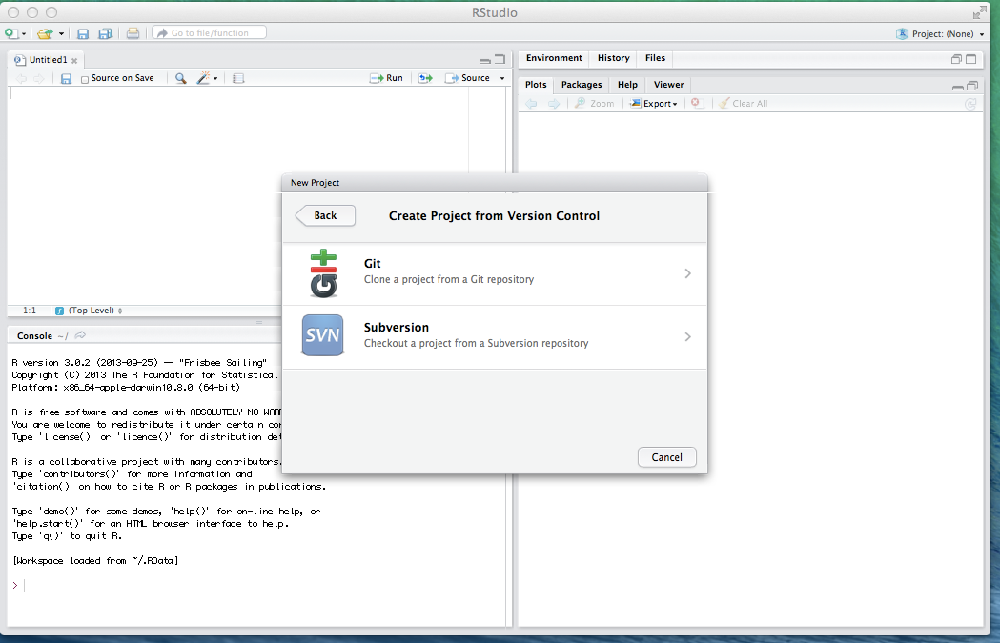

euromomo
========

Developement branch for the EuroMoMo hackathon

To use you need 
 1. A github ID. There should be a link "sign in" in the top right corner. Send this ID to me (mjv).
 2. Go through the simple steps suggested to you during the sign in procedure
 3. Install RStudio, R, R package devtools
 4. Open RStudio. Top right, click "project" 
 5. Select "New project" 
 6. Select "Version control" 
 6. Select Git 
 7. Fill in as in (you should choose your own working directory, the last parameter)  
